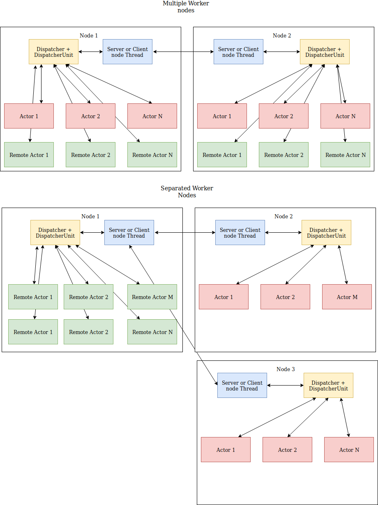

[](https://travis-ci.org/sonic182/carrera)
[](https://coveralls.io/github/sonic182/carrera?branch=master)
[](https://badge.fury.io/py/carrera)
[](https://carrera.readthedocs.io/en/latest/?badge=latest)

# Carrera

Concurrency Framework

# Diagram




# Development

Install package
```bash
pip install -e ".[test]"
```

Develop... an then run test with pytest
```bash
pytest
```

# Contribute

1. Fork
2. create a branch `feature/your_feature`
3. commit - push - pull request

Thanks :)
